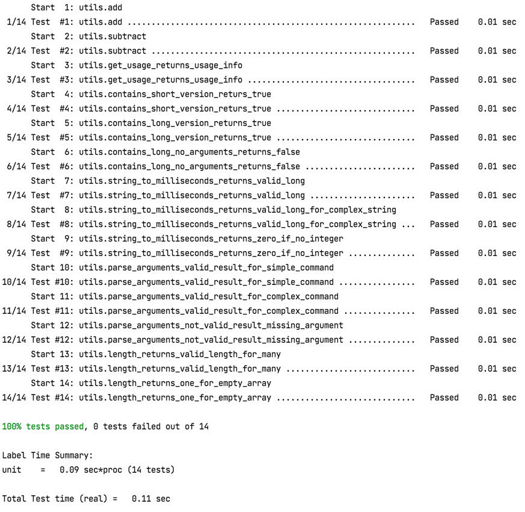

# ITS8020
Assignment [description](https://gitlab.cs.ttu.ee/henvas/its8020-materials/-/tree/master/assignment/watch)  
Template for this project is based on [this](https://github.com/bast/gtest-demo) example 
but modified to support C and latest GoogleTest  
Technologies: **C/C++**, **CMake**, **GoogleTest**

## Setup (Optional)
Linux dev setup is based on [this](https://github.com/maliksahil/docker-ubuntu-sahil) repository  
[Post](https://www.codemag.com/article/1811021/Docker-for-Developers) about Linux dev setup  


## Build
Go to the project root and create a folder for build files
```
cd ITS8020
mkdir build
```

Init project with cmake, it will generate all required files to build the project
```
cd build
cmake ..
```
Build the project
```
make
```

## Run
```
cd build/bin
./watch_command_posix -n 1 echo test
```


## Test
```
cd build
ctest
```



## Clean the build
```
cd build
make clean
```

